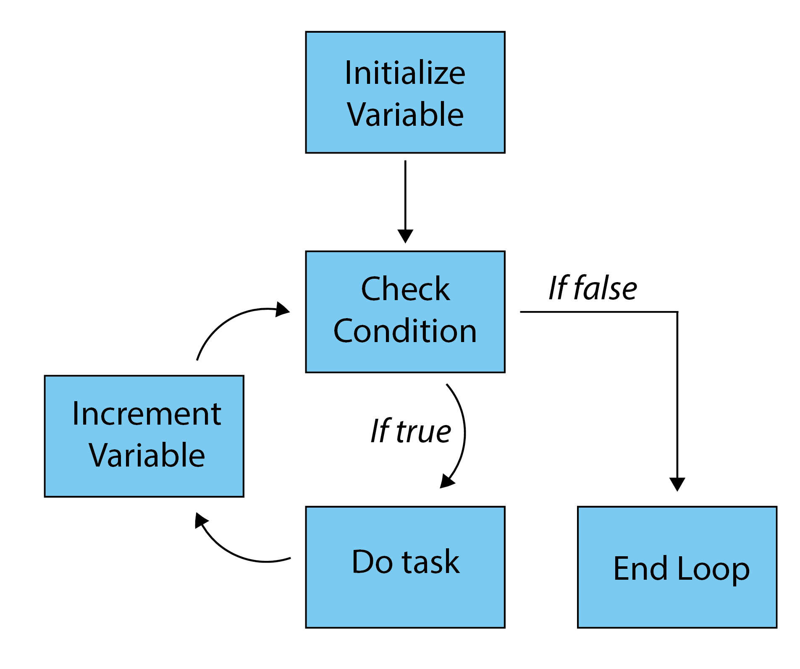

# Basics of *for* Loops

## The Problem

You have a long list of items that you would like a series of commands to be iterated over. Common examples of this could be:

* You want to repeat an action a set number of times
* You want to modify many similar files

## The Solution

Loops!!! All of these problems are perfect places to implement loops. Loops are a common programming structure found in virtually all programming languages. Generally speaking, there are several varieties of loops including *for* loops, *while* loops, *until* loops among others. The most common loops are *for* loops, but the other loops certainly have their places. For example, *while* loops are frequently used for reading files. In this tutorial, we are going to focus on *for* loops.

## Expected Learning Outcomes

* To modify an existing *for* loop
* To design a *for* loop

## Basic Syntax

*for* loops generally have several key components:

* A counter variable
* An end condition
* A task
* An increment


### Counter Variable

This will be the variable that you will be changing with your *for* loop. 

### End Condition

This is the condition that will continue to run your loop as long as it returns TRUE. 

### Task

This is what do you want the loop to do each time the condition returns TRUE. 

### Increment

This is the step size with which you would like to increase the counter variable. It should be noted that when using *for* loops on a list of items, a default increment of 1 is assumed.

<p align="center" >
  
</p>

## Examples

A C-style *for* loop in *bash* would look like this:

```
  for (( i = 0; i <= 10; i = i + 1 )); do
    echo $i
  done
```
And it should produce this output:

```
0
1
2
3
4
5
6
7
8
9
10
```

Let's break down each of these components.

-`i = 0` This is your counter variable. We are initializing it and setting it equal to 0. Of course, you could set this to anything you want. 

-`i <= 10` This is your end condition. If counter variable `i` is less than or equal to 10, then the loop will run.

-`i = i + 1` This is your increment. After each iteration of your loop, your counter variable will be increased by 1. Of course, you could set the value added to anything and you could do something like `i = i + 2` if you wanted the increment step to be two each time.

### Infinite Loops

Infinite loops are loops where the end condition is never met and thus would continue infinitely. Once this happens, no worries, everyone does this on accident sometimes. To end an infinite loop, just hit `Control + C` and this will cancel the command. An example of an infinite loop could be something like this:

```
for (( i = 0; i <= 10; i = i )); do
    echo $i
done
```

As you can see in this example, I have just set my increment to be equal to itself and not to actually increment. In this case, *i* is always 0 and thus it always returns the end condition of `i <= 10` as TRUE.

### A few shortcuts

Few people actually write their *bash for* loops as explicitly as I have done above. There are a few shorthands that you will often see. 

#### *i++*

Instead of `i = i + 1`, people will often shorten this to `i++`. `i++` and `i = i + 1` are equivilant terms. The only downside to this shorthand is that you *have* to use increments of one, which for most people's purposes is what they want anyway. An example of this would look like:

```
  for (( i = 0; i <= 10; i++ )); do
    echo $i
  done
```

#### *$(seq START END)*

-`$(seq START END)` This uses the `seq` command in *bash* to create a sequence with an increment size of one. The following *for* loop gives the same output as the previous *for* loop.

```
  for i in $(seq 0 10); do
    echo $i
  done
```

#### *{START..END}*

-`{START..END}` This can further be shortened to look like this. This form is the most common form of *for* I find people use. An example that is equivilant to the above examples is simply:

```
  for i in {0..10}; do
    echo $i
  done
```

You can see that this is ***MUCH*** easier to work with than the previous C-style *for* loop. 

#### *$(seq START INCREMENT END)*

This is similar  to `$(seq START END)` but this allows you to pick your increment step. If you wanted to go from 0 to 10 by twos you would use:

```
  for i in $(seq 0 2 10); do
    echo $i
  done
```

#### *{START..END..INCREMENT}* (if using Bash v4.0+) 

Similarly, if you are running Bash v4.0+, then this is similar to `{START..END}`, but with the increment component added to it. To once again go from 0 to 10 by twos you would say:

```
  for i in {0..10..2}; do
    echo $i
  done
```

### Lists

Another common way people use *for* loops in *bash* is to interate through a list. An example of this would look like this list of colors:

```
for i in red orange yellow green blue indigo violet; do
  echo $i
done
```

If you had multi-word elements in this list (I would try to use underscores instead of spaces), but you can use `''` to capture it like we have done for dark orange, emerald green and pale blue below:

```
for i in red 'dark orange' yellow 'emerald green' 'pale blue' indigo violet; do
  echo $i
done
```

This might seem not particularly useful until you realize that you can create these lists using other commands in *bash*. The above `$(seq START END)` command is an example of this. Another example could be that you may want to make a list of every file in your current directory this like:

```
for i in $(ls); do
  echo $i
done
```

Or equally as interesting, perhaps you wanted to *echo* to each of your files that had a .txt extension. You could simply use:

```
for i in *.txt; do
  echo $i
done
```

### Nested *for* loops

One of the great parts of loops is that you can put them within one another. A simple example could look like this:

```
for i in {1..5}; do
  for j in a b c; do
    echo $i$j
  done
done
```
This would produce output like:

```
1a
1b
1c
2a
2b
2c
3a
3b
3c
4a
4b
4c
5a
5b
5c
```
## Comprehension Check

***Question 1***

Which of these is **NOT** a necessary part of a *for* loop?

A) Counter Variable

B) End Condition

C) Associative Array

D) Increment

***Question 2***

Without using the command line, which of these *for* loops will *echo* the counter variable from 1 to 5 with an increment of 1?

A)

```
for (( i = 1; i <= 5; i = i + 1 )); do
  echo $i
done
```

B) 
```
for i in {1..5..1}; do 
  echo $i; 
done
```

C)
```
for i in $(seq 1 2 1);do 
  echo $i; 
done
```

D) All of the above


## Practice Problems

With a partner next to you, work on the following problems:

1) Use a *for* loop to echo the numbers between 4 and 14.

2) **CHALLENGE** Within a directory you have five .fasta files (named sequence_1.fasta, sequence_2.fasta, sequence_3.fasta, sequence_4.fasta, sequence_5.fasta) that are taking up some space. You would like to compress only the odd numbered sequences using the *gzip* command. Design a *for* loop to accomplish this task.
